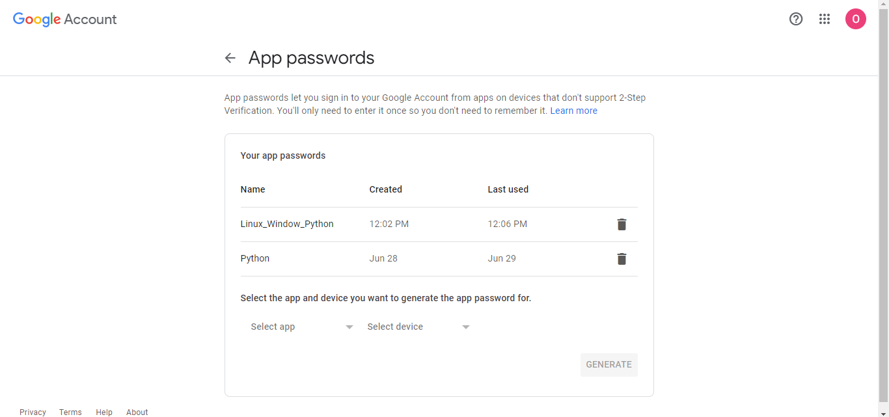
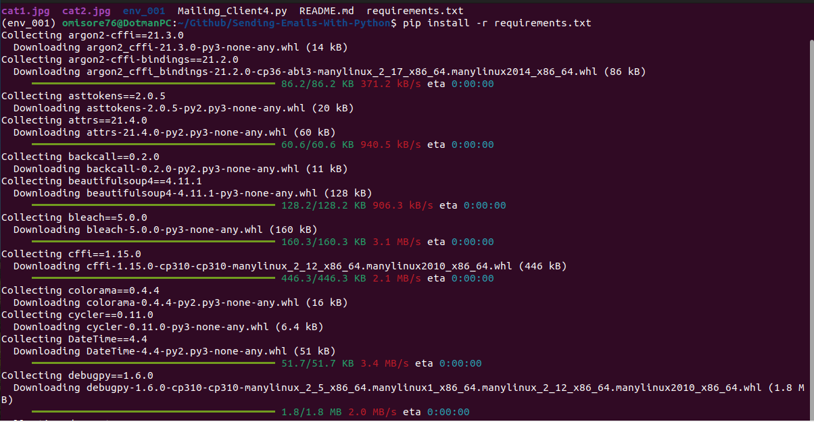

# Mailing-Client

## Introduction

Hey everyone, welcome to my Python script for sending emails! This script is super easy to use and only requires a few inputs from you, the user. With this script, you can easily send images and pdfs along with your email - making it perfect for a variety of situations. So go ahead and give it a try - I think you'll be surprised at how easy it is to use! Thanks for checking it out.

## Prerequisite

- Gmail address with two-step verification enabled

- Python3 installed on your local address

## How to Use This Repo

### Generate an authentication password for your Gmail address.

- Copy and paste the address below into your browser
```
myaccount.google.com/apppasswords
```
- Sign in with your email address and password

- Click **Select app** and choose `mail`. Click **Select device** and choose `other`. Give the device any name of your choice, e.g., Python_Email_Authentication.



- Finally, click Generate. Copy and save the password generated, as it will be used to authenticate your Gmail address.

### Environment variables

You need to create two environment variables: `GMAIL_ADDRESS` and `GMAIL_PASSWORD`.

#### How to create an environment variable in Linux

- Open the `.bashrc` file on your computer using any editor of your choice. This file is located in the home directory.

- To open this file using the visual code editor, enter the code below
```
code ~/.bashrc
```
To use nano, enter:
```
nano ~/.bashrc
```
- Now, add the two environment variables below in the file:
```
GMAIL_ADDRESS=’myemailaddress.com’
GMAIL_PASSWORD=’passwordgenerated’
```
**myemailaddress.com** is your email address

**passwordgenerated** is the password we generated earlier on myaccount.google.com/apppasswords

Note: Remember to enclose the email address and password in a single quote.

### Running prokect on local device

- Fork the repo

- Clone it on your local machine

- While in the project repo on your local machine, create a virtual environment. Run the code below to create a virtual environment
```
	python3 -m venv venv_001
```
- Activate the virtual environment
```
	source venv_001/bin/activate
```
- Install requirements
```
	pip install -r requirements.txt
```


- Run the app
```
	python3 Mailing_Client4.py
```
- You will be prompted to enter some details, such as the recipient's email address, the subject of the mail, and the body of the mail.

- Finally, deactivate the virtual environment once done 
```
deactivate
```

## Note

Remember to delete the images attached in this repo if you don’t need them. Also, feel free to copy some images into the project directory if you would like to attach some images to your mail. Remember to edit the source code to include the images when you attach new images to this project. 

Also, feel free to edit the code to suit your needs.


